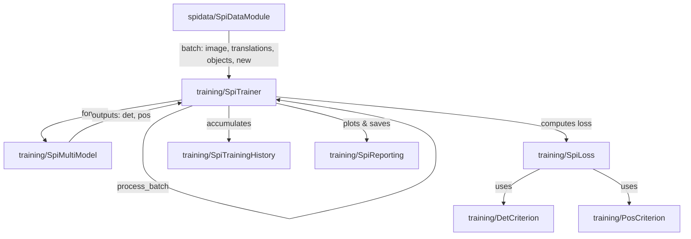

# Proje Özeti

Bu projede `spidata` modülü altında PyTorch `Dataset` yapısını temel alan `SpiDataset` sınıfı, buna uygun veri artırım (data augmentation) işlemlerini gerçekleştiren `SpiTransforms` yapısı, veri yükleyicilerini yöneten `SpiDataLoader` ve son olarak `SpiMultiModel` modelinin eğitilmesini sağlayan eğitim modülleri (`loss.py`, `reporting.py`, `trainer.py`) implemente edilmiştir.

## Yapılan Değişiklikler ve Özellikler

1. **SpiDataset Sınıfı (`dataset.py`):**
   - **Görüntü Yükleme:** `frames_path` altındaki görüntüler otomatik olarak okunur ve RGB formatına dönüştürülür.
   - **Translasyon Yükleme:** `translations_path` altındaki CSV dosyası okunarak her bir kareye ait 3 boyutlu translasyon verileri (`translation_x`, `translation_y`, `translation_z`) numpy dizisi olarak yüklenir. `filter_missing_translations` parametresi True olduğunda translasyon bilgisi olmayan/eksik kareler veri kümesinden elenir.
   - **Etiket Yükleme (Objects):** Nesne etiketleri, ilgili görüntünün adıyla aynı adı taşıyan `.txt` dosyasından otomatik olarak okunur. XML etiketlerinin bulunması durumunda `create_txt_folder_from_xml` metodu çağrılarak bu `.txt` dosyaları otomatik üretilir.
   - **Rastgele Örnekleme:** `get_random_sample()` metodu eklenerek veri kümesinden rastgele bir veri örneği döndürülmesi sağlanmıştır.

2. **SpiTransforms Yapısı (`transformations.py`):**
   - **Albumentations Entegrasyonu:** Eski torchvision tabanlı dönüşümler yerine bounding box (sınır kutusu) ve translasyon uyumlu **Albumentations** (`ReplayCompose`) kütüphanesine geçiş yapılmıştır.
    - **SpiTransformsWrapper Sınıfı (Eğitim/Training):** Dönüşüm uygulandığında sadece görseli değil, görselle birlikte sınır kutularını (YOLO xywh normalize) ve 3 boyutlu kamera translasyon değerlerini de güncelleyen bir sarmalayıcı sınıf yazılmıştır.
     - `HorizontalFlip` uygulandığında yatay translasyon ($x$) işareti tersine çevrilir.
     - `VerticalFlip` uygulandığında dikey translasyon ($y$) işareti tersine çevrilir.
     - `Rotate`, `ShiftScaleRotate` veya `Affine` dönüşümleri uygulandığında oluşan rotasyon matrisi (`params['matrix']`) kullanılarak $x$ ve $y$ translasyon vektörleri döndürülür.
    - **SpiInferenceTransform Sınıfı (Çıkarım/Inference):** Çıkarım sırasında veri kümesine dokunulmasını önlemek amacıyla sadece görüntüyü 640x640 boyutuna getiren özel bir sınıf yazılmıştır. Translasyon değerleri ve nesneler üzerinde hiçbir değişiklik yapılmaz.

3. **SpiDataLoader Sınıfı (`dataloader.py`):**
   - **Sıralı Veri Bölme (Sequential Split):** Veriyi karıştırmadan, verilen `train_ratio` oranına göre böler. Örneğin `train_ratio=0.8` ise ilk %80'lik dilim eğitim (train), kalan %20'lik dilim doğrulama (validation) veri kümesi olarak ayrılır.
   - **Karıştırmasız Yükleme (No Shuffling):** Eğitim de dahil olmak üzere hiçbir durumda karıştırma (shuffle) yapılmaz; `shuffle=False` as sabitlenmiştir.
   - **Güvenli Harmanlama (Safe Collation):** Farklı görsellerde değişken sayıda nesne (sınır kutusu) bulunabileceği için özel bir `collate_fn` implemente edilmiştir. Görseller `(B, C, H, W)` tensor formatına ve translasyonlar `(B, 3)` tensor formatına dönüştürülüp birleştirilirken, nesne listesi güvenli şekilde list yapısında tutulur.
   - **Loader Erişim Kolaylığı (Alias):** Kullanıcının tercihine göre hem `.train_loader` / `.val_loader` hem de `.trainloader` / `.valloader` üzerinden yüklere erişim sağlanmıştır.

4. **SpiDataModule Sınıfı (`datamodule.py`):**
   - **Çoklu Datapack Desteği:** Birden fazla `DataPack` alarak her biri için ayrı `SpiDataLoader` oluşturur.
   - **Sıralı Çok-Sekans İterasyonu:** `SpiSequentialDataLoader` sarmalayıcısı sayesinde eğitim ve doğrulama loader'ları alt loader'ları sırayla tüketir; birinin tüm verisi bitmeden diğerine geçilmez.
   - **`new` Bayrağı:** Her alt loader'ın ilk batch'inde `batch["new"] = True`, diğerlerinde `False` döner. Böylece yeni bir sekansa geçildiğini dışarıdan tespit etmek mümkündür.
   - **Alias Erişim:** `.trainloader` / `.valloader` takma adları ile kolay erişim sağlanmıştır.

5. **Kayıp Yönetimi (`loss.py`):**
   - **DetCriterion:** Modelin nesne tespiti başlığından gelen outputs üzerinde Focal Loss (sınıflandırma), GIoU Loss (bbox regresyonu) ve Centerness Loss hesaplamalarını gerçekleştirir.
   - **PosCriterion:** Modelin translasyon başlığından gelen outputs üzerinde MSE kaybı hesaplar.
   - **SpiLoss:** Her iki kaybı yönetir. `det_only` modunda translasyon kaybını sıfırlayarak sadece nesne tespitiyle eğitimi; `multi_task` modunda ise iki kaybın ağırlıklı toplamı ile eğitimi destekler.

6. **Raporlama ve Takip (`reporting.py`):**
   - **SpiEpochMetric & SpiTrainingHistory:** Eğitim sırasındaki tüm alt kayıpları epoch bazlı takip eden ve saklayan sınıflar.
   - **SpiReporting:** Eğitim sürecinin son durumunu ve kayıplarını görsel grafiklere dönüştürerek `history_plot.png` ve `metrics.json` dosyası olarak diske kaydeder.

7. **Eğitici Modülü (`trainer.py`):**
   - **SpiTrainModules:** Model, optimizer, scheduler, grad_scaler ve eğitim modunu (`mode`) sarmalar; parçalı kaydetme ve geri yükleme işlemlerini yönetir.
   - **SpiTrainer:** Eğitim döngüsünü kontrol eden ana sınıftır.
     - **Parçalı Model Kaydetme:** Modeli tek parça halinde kaydetmek yerine, esnek ayrı ayrı eğitim senaryolarını desteklemek için şu parçalara bölerek kaydeder:
       - `shared.pth`: Backbone + Neck parametreleri.
       - `odbranch.pth`: Odhead parametreleri.
       - `posbranch.pth`: Tneck + Poshead parametreleri.
       - `trainer_state.pth`: Optimizer, scheduler, scaler ve trainer durumu (history, patience vb.).
       Bu dosyalar hem `best_` hem de `last_` önekiyle kaydedilir.
     - **Otomatik Parçalı Yükleme:** `load_checkpoint` metoduna herhangi bir parçanın `.pth` yolu veya klasör yolu verildiğinde, ilgili öneğe ait 4 parçayı da tespit edip otomatik olarak geri yükler.
     - **KeyboardInterrupt (CTRL+C) Desteği:** Eğitim sırasında CTRL+C yapıldığında eğitimi güvenli bir şekilde keser, son validasyon adımını koşturur, mevcut ağırlıkları ve raporları kaydedip eğitim özetini terminale basar.
      - `new` sekans bayrağı geldiğinde `model.prev = None` atamasıyla modelin temporal cross-attention durumunu sıfırlar.
      - `det_only` modunda temporal durumu `model.prev = None` ile sıfırlar; veri artırımından tam verim alınmasını sağlar.
     - Erken durdurma (early stopping) ve en iyi modeli minimum validation loss değerine göre kaydetme işlevlerine sahiptir.

8. **Örnek Eğitim Betiği (`train_example.py`):**
   - `example/train_example.py` dosyası güncellenerek:
     - `run_od_training_example`: Sadece nesne tespiti (`od_head` ve ortak katmanlar) dondurma işlemi ile eğitilir, `pos_head` dondurulur.
     - `run_pos_training_example`: Sadece translasyon/konum tahmini (`pos_head`, `tneck` ve ortak katmanlar) dondurma işlemi ile eğitilir, `od_head` dondurulur.
     - `resume_training_example`: Parçalı model resume işlemlerinin nasıl yapılacağını gösterir.

9. **Tiling ve Etiket Formatı Düzeltmeleri (`tiling.py`):**
   - `TileGenerator._crop_objects` artık **YOLO xywh** formatında (cx, cy, w, h) giriş alıp aynı formatında çıkış verir. Önceki sürüm xyxy (köşe) koordinatları varsaydığından, `SpiDataModule` üzerinden yapılan eğitimde tüm nesneler sessizce düşürülüyordu ve model yalnızca background öğreniyordu.
   - Tile ile kırpma: xywh -> köşelere çevir -> tile ile kırp -> tile koordinatında normalize et -> xywh'ye geri dön.

10. **Trainer Logic Düzeltmeleri (`trainer.py`):**
    - `model.temporal` ataması kaldırıldı: `SpiMultiModel`'de böyle bir attribute yoktu, atama no-op'tu. Sadece `model.prev = None` (temporal cross-attention durumu sıfırlama) bırakıldı.
    - `_process_batch` yorumu düzeltildi: `xmin,ymin,xmax,ymax` → `cx,cy,w,h` (YOLO xywh). Kod zaten sütun 1:5'i loss'a olduğu gibi paslıyordu, yalnızca yorum eski kalmıştı.

11. **Test Düzeltmeleri (`test_dataset.py`):**
    - Görüntü boyutu assert'leri 512x512'den 640x640'a güncellendi; transformlar (`RandomCropOrResize(640)`, `SpiInferenceTransform((640,640))`) zaten 640 üretiyordu, eski testler fail ediyordu.

12. **OdHead Reg Aktivasyonu (`base.py`):**
    - `OdHead.reg_out` çıkışına `F.relu` uygulandı. LTRB mesafeleri (left/top/right/bottom) pozitif olmalıdır; aksi halde decoder'da `x1 = cx - l` ile `l < 0` olduğunda `x1 > cx` çıkar ve box geometrisi içe değil dışa açılır. `F.relu` ile pozitiflik garantilenir. `cls_out` ve `ctr_out` üzerinde değişiklik yok (bunlar loss/decoder tarafında sigmoid uygulanıyor).

13. **cls_loss Normalizasyonu (`loss.py`):**
    - `DetCriterion`'da focal cls loss normalizasyonu `HW * num_classes` yerine `max(num_pos, 1)` olarak değiştirildi. Önceki ifade tüm uzamsal hücre sayısına böldüğünden sınıflama kaybı under-weighted kalıyordu; `num_pos` tabanlı normalizasyon FCOS/RetinaNet standardıyla uyumlu. `num_pos == 0` (boş GT) durumunda `max(num_pos, 1)` ile NaN oluşumu engellendi.

14. **Dead-Code Temizliği (`packets.py`):**
    - `OdObject.from_xy1xy2_norm` (eski xyxy constructor'ı) silindi. Etiket formatı YOLO xywh'a geçildiğinden bu metot hiçbir yerde kullanılmıyordu; `from_xywh_norm` tek constructor olarak bırakıldı.

15. **Docstring Güncellemeleri:**
    - `base.py` Backbone/FocusStem/DeepStem docstring'lerinde "512x512 → 128x128" ifadeleri "640x640 → 160x160" olarak düzeltildi (gerçek girdi boyutu 640).
    - `tools/visualize.py` docstring'inde "xyxy" → "YOLO xywh" yapıldı.
    - `examples/datamodule.py` yorumundaki `(B, 3, 512, 512)` → `(B, 3, 640, 640)` düzeltildi.

## Bağlantılar Şeması (Chart)

Aşağıdaki şemada veri yükleme, model, kayıp fonksiyonları ve eğitici arasındaki veri akışı ve bağlantı ilişkileri gösterilmiştir:

