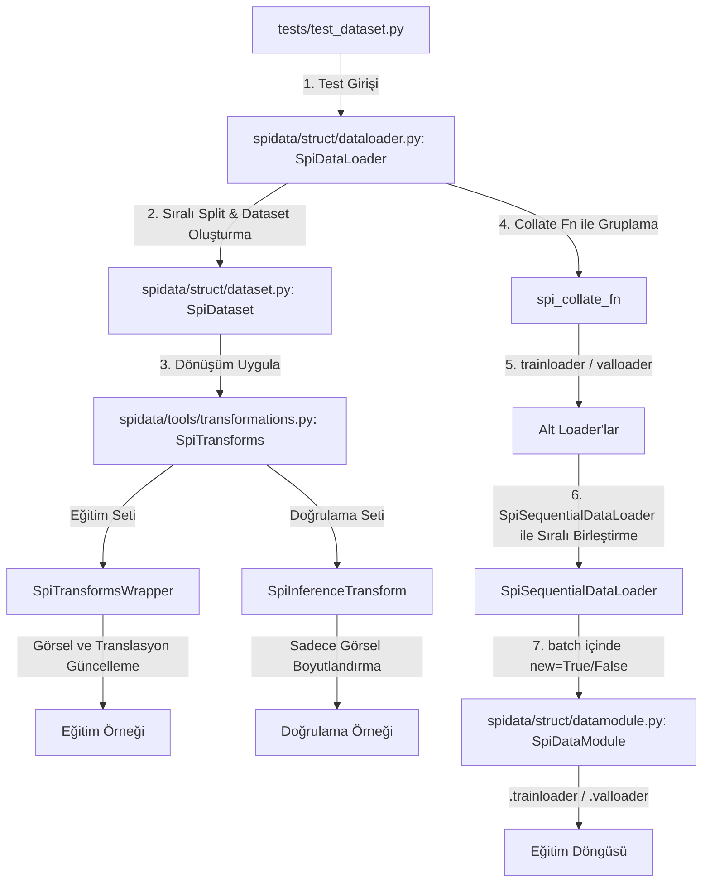

# Proje Özeti

Bu projede `spidata` modülü altında PyTorch `Dataset` yapısını temel alan `SpiDataset` sınıfı, buna uygun veri artırım (data augmentation) işlemlerini gerçekleştiren `SpiTransforms` yapısı ve veri yükleyicilerini yöneten `SpiDataLoader` implemente edilmiştir.

## Yapılan Değişiklikler ve Özellikler

1. **SpiDataset Sınıfı (`dataset.py`):**
   - **Görüntü Yükleme:** `frames_path` altındaki görüntüler otomatik olarak okunur ve RGB formatına dönüştürülür.
   - **Translasyon Yükleme:** `translations_path` altındaki CSV dosyası okunarak her bir kareye ait 3 boyutlu translasyon verileri (`translation_x`, `translation_y`, `translation_z`) numpy dizisi olarak yüklenir. `filter_missing_translations` parametresi True olduğunda translasyon bilgisi olmayan/eksik kareler veri kümesinden elenir.
   - **Etiket Yükleme (Objects):** Nesne etiketleri, ilgili görüntünün adıyla aynı adı taşıyan `.txt` dosyasından otomatik olarak okunur. XML etiketlerinin bulunması durumunda `create_txt_folder_from_xml` metodu çağrılarak bu `.txt` dosyaları otomatik üretilir.
   - **Rastgele Örnekleme:** `get_random_sample()` metodu eklenerek veri kümesinden rastgele bir veri örneği döndürülmesi sağlanmıştır.

2. **SpiTransforms Yapısı (`transformations.py`):**
   - **Albumentations Entegrasyonu:** Eski torchvision tabanlı dönüşümler yerine bounding box (sınır kutusu) ve translasyon uyumlu **Albumentations** (`ReplayCompose`) kütüphanesine geçiş yapılmıştır.
   - **SpiTransformsWrapper Sınıfı (Eğitim/Training):** Dönüşüm uygulandığında sadece görseli değil, görselle birlikte sınır kutularını (xyxy normalize) ve 3 boyutlu kamera translasyon değerlerini de güncelleyen bir sarmalayıcı sınıf yazılmıştır.
     - `HorizontalFlip` uygulandığında yatay translasyon ($x$) işareti tersine çevrilir.
     - `VerticalFlip` uygulandığında dikey translasyon ($y$) işareti tersine çevrilir.
     - `Rotate`, `ShiftScaleRotate` veya `Affine` dönüşümleri uygulandığında oluşan rotasyon matrisi (`params['matrix']`) kullanılarak $x$ ve $y$ translasyon vektörleri döndürülür.
   - **SpiInferenceTransform Sınıfı (Çıkarım/Inference):** Çıkarım sırasında veri kümesine dokunulmasını önlemek amacıyla sadece görüntüyü 512x512 boyutuna getiren özel bir sınıf yazılmıştır. Translasyon değerleri ve nesneler üzerinde hiçbir değişiklik yapılmaz.

3. **SpiDataLoader Sınıfı (`dataloader.py`):**
   - **Sıralı Veri Bölme (Sequential Split):** Veriyi karıştırmadan, verilen `train_ratio` oranına göre böler. Örneğin `train_ratio=0.8` ise ilk %80'lik dilim eğitim (train), kalan %20'lik dilim doğrulama (validation) veri kümesi olarak ayrılır.
   - **Karıştırmasız Yükleme (No Shuffling):** Eğitim de dahil olmak üzere hiçbir durumda karıştırma (shuffle) yapılmaz; `shuffle=False` olarak sabitlenmiştir.
   - **Güvenli Harmanlama (Safe Collation):** Farklı görsellerde değişken sayıda nesne (sınır kutusu) bulunabileceği için özel bir `collate_fn` implemente edilmiştir. Görseller `(B, C, H, W)` tensor formatına ve translasyonlar `(B, 3)` tensor formatına dönüştürülüp birleştirilirken, nesne listesi güvenli şekilde list yapısında tutulur.
   - **Loader Erişim Kolaylığı (Alias):** Kullanıcının tercihine göre hem `.train_loader` / `.val_loader` hem de `.trainloader` / `.valloader` üzerinden yüklere erişim sağlanmıştır.

4. **SpiDataModule Sınıfı (`datamodule.py`):**
   - **Çoklu Datapack Desteği:** Birden fazla `DataPack` alarak her biri için ayrı `SpiDataLoader` oluşturur.
   - **Sıralı Çok-Sekans İterasyonu:** `SpiSequentialDataLoader` sarmalayıcısı sayesinde eğitim ve doğrulama loader'ları alt loader'ları sırayla tüketir; birinin tüm verisi bitmeden diğerine geçilmez.
   - **`new` Bayrağı:** Her alt loader'ın ilk batch'inde `batch["new"] = True`, diğerlerinde `False` döner. Böylece yeni bir sekansa geçildiğini dışarıdan tespit etmek mümkündür.
   - **Alias Erişim:** `.trainloader` / `.valloader` takma adları ile kolay erişim sağlanmıştır.

5. **Testler (`test_dataset.py`, `test_datamodule.py`):**
   - `tests/test_dataset.py`: `SpiDataset` ve `SpiDataLoader` yapısı test edilmiştir.
   - `tests/test_datamodule.py`: `SpiDataModule`'ün iki datapack üzerinde sıralı çalıştığı ve `new=True` bayrağının tam geçiş noktasında (batch 450) üretildiği doğrulanmıştır.

## Bağlantılar Şeması (Chart)

Aşağıdaki şemada veri yükleme, bölme ve dönüşüm akışının bağlantıları gösterilmiştir:

